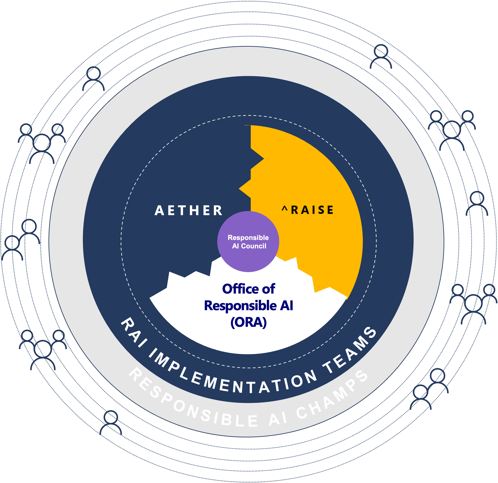
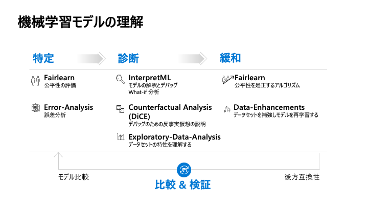

# Responsible AI

AI のテクノロジーが大きな注目を浴びています。便利で画期的な技術が開発される一方で、AI が持つリスクや障害に対応できずに、ガバナンス・セキュリティ・コンプラインスの観点でさまざまな課題が出てきています。そのため、近年はこれまで以上に AI を責任を持って開発し運用管理することが求められています。

本資料では Microsoft の視点から責任のある AI に対する原則などのコンセプトを紹介し、具体的に機械学習ライフサイクルにおいて責任のある AI に関連にする技術を実装・運用管理する方法を説明します。

 

## アジェンダ
1. 責任のある AI 概要
2. 機械学習モデルを理解する
3. 機械学習モデルとデータを保護する
4. 参考情報

 

---

## 1. 責任のある AI 概要
本モジュールでは Microsoft が定義する Responsible AI (aka RAI) にフォーカスし、「責任のある AI の 6 つの原則」、「社内の標準化の活動」、「機械学習ライフサイクルにおける RAI の設計な実践」、「ツール」を紹介します。

 

### 背景

AI の技術が急速に進化しています。AI は人間に近いような動作をするということもあり、意思決定に利用されることが多くなってきました。そのため AI システム全体の透明性に対するニーズが高まっています。AI モデルの観点では説明可能性が高いことが求められます。透明性が無い AI システムはステークホルダーの信頼を失い、AI の社会実装を妨げる一つの大きな要因です。しかしながら、責任のある AI はまだ十分に浸透しているとは言えません。AI システムのプライバイシーの懸念、誤動作、副作用などの課題に対して、誰が責任を取るのか、どのように対処するのかがルール化されていないことがあります。本資料では、責任のある AI の概念や技術について説明を行い、人間中心で信頼された透明性の高い AI システムの構築・運用管理をサポートすることを目的として記載しています。

"The more powerful the tool, the greater the benefit or damage it can cause ... Technology innovation is not going to slow down. The work to manage it needs to speed up." Brad Smith, President and Chief Legal Officer, Microsoft

 

### Microsoft の責任のある AI への取り組み

Microsoft 自身も責任のある AI に取り組んでいます。

- 2016年 : Satya Nadella が "The Partnership of the Future" という論説を投稿。透明性、効率性、プライバシーの尊重、バイアスからの保護などに言及している。
- 2017年 : Aether (AI, Ethics, and Effects in Engineering and Research) を設立しました。ここは Microsoft 社内の責任のある AI に関する最高機関になっており、様々な責任のある AI の課題、テクノロジー、プロセス、ベストプラクティスに関する提言を行なっています。
- 2018年 : The Future Computed という書籍を公表しました。AI が社会にもたらす課題、AI をどうすれば責任がある形で開発され、運用されるのか、どのようにガバナンスを制定すればいいのかについて Microsoft の見解を述べているものです。次のスライドでご説明する 6 つの基本原則についても言及しています。まだ2018年に、顔認証技術の透明や独立した第三者機関によるテストの法規制の必要性を訴えています。
- 2019年 : Office of Responsible AI を設立しました。ポリシーやガバナンスのプロセスを策定しています。また、Responsible AI Standard (v1) を発行しました。
- 2020年 : RAISE (Responsible AI Strategy in Engineering) はエンジニアリンググループ全体で責任のある AI のルールとプロセスの実装を促進するために設立されました。
- 2021年 : Responsible AI Standard (v2) を発行しました。また最近ではマイクロソフトのこれまでの培ってきた知見を社会・お客様に伝えていくべく、AI Business School という責任のある AIについて学べるビジネス向け学習コンテンツ、ガイドライン、オープンソースのツールを公開しています。

 

### 責任のある AI の 6 つの原則

Microsoft は AI システムの開発および運用管理における責任のある AI の原則を 6 つ定義しています。

 

- 公平性 (Fairness)
    - AI システムは全ての人を公平に扱い、同じ属性・状況の人たちに対して異なる影響を与えることを回避する必要があります。
- 信頼性と安全性 (Reliability & Safety)
- プライバシーとセキュリティ (Privacy & Security)
    - AI システムではデータを扱うためプライバシーとセキュリティの保護が必要です。
- 包括性 (Inclusiveness)
    - AI システムに限らず技術は全ての人にもたらされるべきで、様々なニーズに対応していく必要があります。
- 透明性 (Transparency)
    - AI システムが意思決定に利用される場面などでは、どのように AI システムが決定を行ったのかを理解することが重要です。
- アカウンタビリティ (Accountability)
    - AI システムを設計・構築・運用管理する人は、システムがどのように動作するかについて説明責任があります。

### 責任のある AI の実践

これらの 6 つの原則をベースに、設計フェーズから責任のある AI が考慮された AI システムが統制の効いたガバナンスの元に実装されるために Microsoft が社内外に公開している取り組みを紹介します。

#### プラクティス
最初は、人間中心のデザインに基づくプラクティスです。ソフトウェア開発のライフサイクルにおける問題を予測し、それを解決することで責任のある方法で AI システムを開発することをサポートするガイドラインを提供しています。

- Human-AI Guidelines
    - これは Human-AI eXperiences (HAX) Toolkit に含まれます。
- Conversational AI Guidelines
- Inclusive Design Guidelines
- AI Fairness Checklist
- Datasheets for Datasets
- AI Security Guidelines

その取り組みの結果として 例えば [Transparency Note for Azure Cognitive Service for Language](https://docs.microsoft.com/en-us/legal/cognitive-services/language-service/transparency-note) などの Transparency Note を公開し、AI システムの目的、能力、限界についてのコミュニケーションを支援し、マーケティングと技術文章のギャップを埋め、お客様が責任を持って AI を導入するために知っておくべき情報を積極的に伝えています。その他、Azure Cognitive Services 全般における責任のある AI のガイドラインは [Cognitive Services における AI の責任ある使用](https://docs.microsoft.com/ja-jp/azure/cognitive-services/responsible-use-of-ai-overview) で確認できます。

#### ツール

開発チームなどがあらゆる AI の構築・運用のライフサイクルにおいて AI を理解し、保護し、制御するためのツールを開発しています。

モデル開発フェーズにおいては、Azure Machine Learning 上であらゆるツールが実行できます。

- 理解 (Understand)
    - AI システムの挙動を理解します。公平性、透明性の観点が重要になることが多いです。
    - ツール : InterpretML、Fairlearn、Error Analysis、Responsible AI Toolbox など。
- 保護 (Protect)
    - モデルやデータを外部からの攻撃や潜在的なリスクから保護します。
    - ツール : 差分プライバシー、機密コンピューティングなど。
- 制御 (Control)
    - ガバナンス統制下で責任ある形で開発が進められるようにします。
    - ツール : MLOps、監査証跡、データシートなど。
 

責任のある AI に関連したツールの一覧表です。最新の情報は [責任ある AI のリソース](https://www.microsoft.com/ja-JP/ai/responsible-ai-resources) や [Advancing AI trustworthiness: Updates on responsible AI research](https://www.microsoft.com/en-us/research/blog/advancing-ai-trustworthiness-updates-on-responsible-ai-research/) を参照ください。

#### ガバナンス

Microsoft は Hub and Spokes モデルでガバナンスの体制を構築しています。

また、Microsoft では AI システムの開発の各段階において実行すべき推奨事項をまとめた Responsible AI Standard を作成しています (社内限定の公開)。

 

### Responsible AI Lifecycle (RAIL)

Microsoft は Responsible AI Lifecycle (aka RAIL) を開発しました。これは Responsible AI Standard に沿った形で責任のある AI をシステムに構築・デプロイするためのフレームワークです。詳細は公開されていませんが、下記が概略です。

- 評価と準備
    - 製品がもたらす利益、技術、潜在的なリスク、チームを評価する。
- 設計、構築、文章化
    - 製品がもたらす影響、独自の考慮事項、文章の実践などをレビューする。
- 検証とサポート
    - テスト手順を選択し、製品が意図した通りに動作するか確認する。

 

--- 

## 2. 機械学習モデルを理解する

本モジュールではモデルを理解するための様々な技術を紹介します。Responsible AI Lifecycle の中でも 「設計、構築、文章化」のフェーズで利用する技術です。

- モデルの公平性
    - 学習済みモデルの公平性を評価し、必要に応じて軽減を行います。公平性とは特定のグループに対してモデルが他とは異なる挙動しないことを意味します。特にセンシティブな属性 (人種、ジェンダー、年齢、障害の有無 etc) の観点で考慮されます
- モデルの透明性
    - 機械学習アルゴリズムの解釈性、または説明可能性の技術より、大域的・局所的なトレンドを理解します。これは AI システムを実装する際に Data Scientist が経営者やステークホルダーにモデルを説明する際に役立ちます。また運用中モデルの挙動について説明が求められるようなシーンでも有効ですし、Data Scientist 自身が開発中の機械学習モデルをデバッグする際にも有効です。

これらの技術は下記の 3 つのステップ (特定 → 診断 → 緩和) で実行します。

- Fairlearn
    - 機械学習モデルの公平性の評価と不均衡の軽減・是正を行います。
- Error Analysis
    - モデルの誤差を分析し、誤差が大きいコホートを特定します。
- InterpretML
    - モデルに説明性を付与します。モデル全体の傾向を見る大域的な説明とテストデータ個々の予測値に対する局所的な説明ができます。
- Counterfactual Analysis (DiCE)
    - 最小限度の変化のみで目的変数を変化させる反実仮想のデータを生成します。

### デモンストレーションのシナリオ
ローンの履行・不履行を予測するモデルを作成するシナリオで責任のある AI を考慮した AI システムを構築していきます。UCI Adault Dataset を用いた擬似データを利用します。

### Phase1 : AI システムの評価と準備

このフェーズでは、AI システムの要件を整理し、責任のある形でシステムが構築可能かどうかの検証を行い、潜在的なリスクを洗い出し、必要に応じてリスクを緩和する方法を考えます。下記の質問に回答してみてください。

> AI/ML の技術が本当に必要か？
> 潜在的なリスクがあるか？それはどのようなものか？
> AI システムが誤った挙動や動作停止することがあるか？

以上の情報をベースに AI システムが抱えるリスクと利益 (ステークホルダーの誰が得をして、誰が損害を被る可能性があるか etc)、リスクに対する軽減策と残存するリスク、公平性、セキュリティ、プライバシーの影響などに関して、必要に応じてテストを行い、ドキュメントを作成します。

例えば今回のシナリオで AI システムはローンの審査で利用され、適切なモデルであればローン申込者や銀行へ利益をもたらしますが、AI システムが誤った or 想定とは異なる挙動を起こし、返済不可能な債務を抱える人・企業が増えてしまえば、社会的影響は大きくなる可能性があります。

このような損害 (Harms) はさまざまな種類があります。次のフェーズに入る前に AI システムがそれぞれの損害の種類に該当するのかどうか、該当する場合の損害の大きさを評価します。

 

### Phase2 : AI システムの設計・構築と文章化

近年 Data-centric AI というフレーズが出てきているようにデータの品質が AI システムに大きな影響を与えるため、データの詳細な情報をドキュメントに残しておくことが重要です。[Datasheets for Datasets](https://www.microsoft.com/en-us/research/project/datasheets-for-datasets/) (→[Template](https://query.prod.cms.rt.microsoft.com/cms/api/am/binary/RE4t8QB)) を利用することで、データの透明性と信頼性を高め、ステークホルダー間のコミュニケーションを促進します。

最初のモデル構築は勾配ブースティングのライブラリ CatBoost を用います。

次に解釈可能性の高いモデルである一般化加法モデルを Explainable Boosting Machine (aka EBM) を用いて構築します。

次に最初に構築した CatBoost に InterpretML を利用して説明性を付与します。また、FairLearn を用いて公平性の評価を行い、不公平性を軽減する処置を行います。

 

### Phase3 : AI システムの検証とサポート

Phase2 で精度と責任ある AI の原則とのトレードオフを考慮したモデルが選択されました。Phase3 では本番環境にモデルをデプロイしていきます。主に機械学習エンジニア、DevOps エンジニアが作業を進めますが、データサイエンティストとシームレスに連携する必要があったり、短いサイクルでモデルのリリースや再学習を行う必要性があるため、MLOps を導入します。

今回利用している Azure Machine Learning では GitHub (GitHub Actions) and/or Azure DevOps (Azure Pipelines) 用います。一般的には下記の MLOps のプラクティスを実装します。

- 再現可能な機械学習パイプライン
- 機械学習ライフサイクルの自動化
- 監査証跡の自動取得
- AI システムやモデルの監視
- 通知とアラートの仕組み

> Azure Machine Learning における MLOps の詳細は [MLOps: Model management, deployment, lineage, and monitoring with Azure Machine Learning](https://docs.microsoft.com/en-us/azure/machine-learning/concept-model-management-and-deployment) を参照ください。

モデルの説明性・解釈可能性は、推論時にも必要になるケースがあります。今回のローン審査においては、ローンの審査の結果に大きく影響を与えた属性 (年齢、勤続年数、負債額 etc) が分かることで、銀行がユーザに謝絶理由を説明できたり、銀行の担当者が結果の妥当性を確認することができます。

 

---

## 3. 機械学習モデルとデータを保護する

本モジュールでは機械学習モデルを敵対的攻撃や潜在的な誤用などから保護するための技術を紹介します。

- 意図的な障害
    - 攻撃者は、AI システムの誤分類を発生させたり、個人情報などのプライベートなデータの推測、アルゴリズムの盗みを目的とします。
- 非意図的な障害
    - AI システムが正しい結果だが完全に安全で無い結果を生成します。

想定される具体的な障害の種類は [Machine Learningの エラー モード](https://docs.microsoft.com/ja-JP/security/engineering/failure-modes-in-machine-learning) を参照ください。

### SmartNoise
### Confidential Computing

## 参考資料

<!-- TODO : 表に作り替える -->

### For All

[Microsoft の責任のある AI の原則](https://www.microsoft.com/ja-jp/ai/responsible-ai)
[Responsible AI resources](https://www.microsoft.com/en-us/ai/responsible-ai-resources)

### For Business leaders

<!--`Microsoft Learn -->
[Discover ways to foster an AI-ready culture in your business](https://docs.microsoft.com/en-us/learn/paths/foster-ai-ready-culture/)
[Identify principles and practices for responsible AI](https://docs.microsoft.com/en-us/learn/paths/responsible-ai-business-principles/)
[Identify guiding principles for responsible AI in government](https://docs.microsoft.com/en-us/learn/paths/responsible-ai-government-principles/)

[AI Business School の人工知能コース](https://www.microsoft.com/ja-jp/ai/ai-business-school?rtc=1)

### For Product Leaders

|Action                       |Guidelines                                                                                                      |Column3  |
|-----------------------------|----------------------------------------------------------------------------------------------------------------|---------|
|Assess & prepare             |Assess merit of developing the product considering organizational values and business objectives                |         |
|Assess & prepare             |Assemble team reflecting diverse perspectives and with clearly defined roles and responsibilities               |         |
|Assess & prepare             |Assess potential product impact by including input from domain experts and potentially impacted groups          |         |
|Design, build & document     |Evaluate data and system outcomes to minimize the risk of fairness harms                                        |         |
|Design, build & document     |Design AI product to mitigate the potential negative impact on society and the environment                      |         |
|Design, build & document     |Incorporate features to enable human control                                                                    |         |
|Design, build & document     |Incorporate features to enable human control                                                                    |         |
|Design, build & document     |Take measures to safeguard data and AI products                                                                 |         |
|Design, build & document     |Document throughout the development lifecycle to enable transparency                                            |         |
|Validate & Support           |Validate product performance and test for unplanned failures as well as foreseeable misuse unique to AI products|         |
|Validate & Support           |Communicate design choices, performance, limitations, and safety risks to end user                              |         |

### For Researcher & Data Scientists
